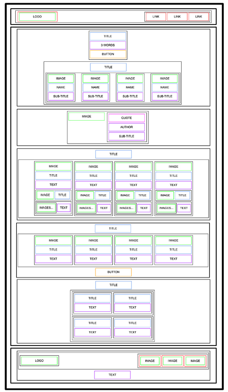

# Html Advanced :heart: :smile: :sparkles:

#### Building Index to fit wire frame lay out

## Learning Objectives

#### What is HTML 
#### How to create an HTML page from a wireframe
#### What is a markup language
#### What is the DOM
#### What is an element / tag
#### What is an attribute
#### What the purpose of each HTML tag

# Wire frame example

## Author:
#### Frank Blation
[linkedIn](https://www.linkedin.com/in/frank-blation-607335282/)
[GitHub](https://github.com/Frankblation)
